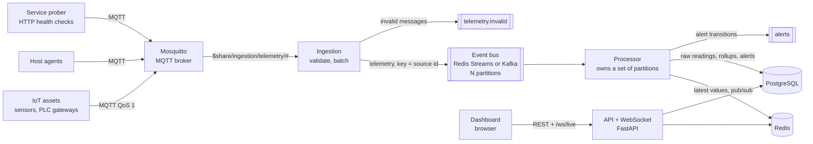
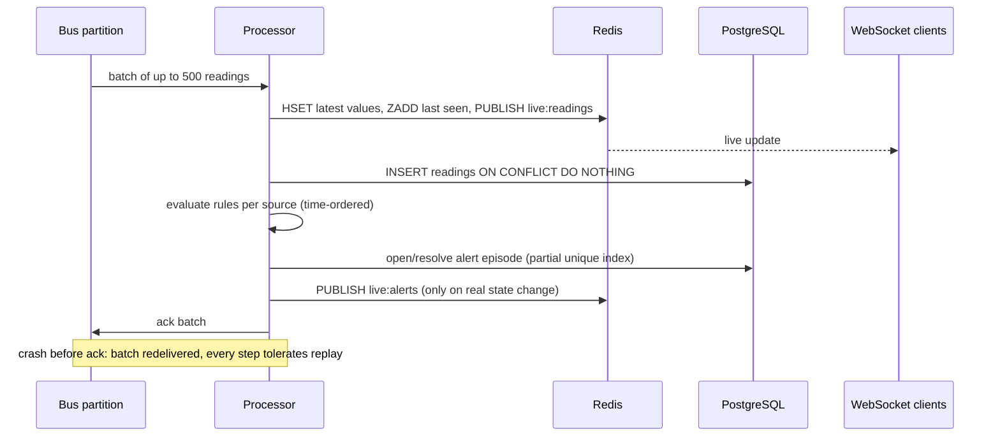

# Architecture

## Goals

- Ingest telemetry from IoT assets, hosts and services over MQTT at high volume without losing data on restarts.
- Keep the latest state and live dashboards current within about a second.
- Raise **one** actionable alert per condition episode, including for sources that go silent.
- Store raw data for days and aggregated data for longer, with bounded cost.

## Components



| Component | Responsibility | Scaling |
|---|---|---|
| **MQTT broker** | Device connectivity, QoS 1 delivery, persistent sessions | Broker cluster / managed IoT hub |
| **Ingestion** | Parse topic + payload, validate (pydantic), normalise to `Reading`, batch to the bus, dead-letter invalid messages | Stateless; MQTT shared subscription splits load across replicas |
| **Event bus** | Durable buffer between ingestion and processing; partitions keyed by source id | Add partitions |
| **Processor** | Latest state, raw writes, rule evaluation, alert episodes, rollups, retention | One owner per partition; add processors up to the partition count |
| **API** | Query latest values, time series (raw or 1-minute), alerts, acknowledgement; WebSocket fan-out | Stateless replicas behind a load balancer |
| **Prober** | Turns HTTP health checks into telemetry (`up`, `latency_ms`) | One per network zone |
| **Simulator** | Demo and load generation | — |

## Data flow and topics

```text
MQTT   telemetry/{site}/{kind}/{sourceId}     kind ∈ asset | host | service
       {"ts": "...Z", "metrics": {"vibration_mm_s": 3.2, "bearing_temp_c": 61.5}, "units": {...}}

Bus    telemetry           key = sourceId → partition = crc32(sourceId) % N
       telemetry.invalid   rejected messages with reason
       alerts              raised / resolved transitions
Redis  latest:{sourceId}   hash metric → {value, unit, ts}
       sources             sorted set sourceId → last seen
       live:readings, live:alerts   pub/sub channels for WebSocket clients
```

## Processing sequence



## Delivery guarantees

| Hop | Guarantee | Mechanism |
|---|---|---|
| Device → broker | At-least-once | MQTT QoS 1 |
| Broker → ingestion | At-least-once | QoS 1 + persistent session (`clean_session=False`) |
| Ingestion → bus | At-least-once | Publish retried with backoff; process exits if the bus stays down |
| Bus → processor | At-least-once | Ack after processing; pending entries re-read on restart |
| Raw storage | Effectively-once | Primary key `(source_id, metric, ts)` + `ON CONFLICT DO NOTHING` |
| Alerts | One open episode per rule and source | Partial unique index; notifications only on actual state change |
| Rollups | Idempotent | Recomputed from raw data for recent minutes (overwrite, not increment) |

## Back-pressure

Ingestion puts readings into a bounded queue. When the bus or processors fall behind and the queue fills, the
ingestion task blocks on `put`, stops reading from the MQTT socket, and the broker buffers messages for the
persistent session. Memory stays bounded and no data is dropped silently; the `ingest_queue_depth` gauge shows
the pressure. See [ADR-001](decisions/ADR-001-mqtt-ingestion-with-backpressure.md).

## Alerting

- **Threshold rules** (`config/rules.json`): `>`/`<` trigger, a hysteresis reset level, a sustain duration,
  severity and the source kinds they apply to.
- **Staleness**: a source that stops reporting for `STALE_AFTER_SECONDS` raises `source-stale` (critical for hosts
  and services, warning for assets) and resolves when data returns. This is how host and service *down* is detected
  even when the failed component cannot report anything.
- **Service health**: the prober publishes `up` and `latency_ms`; `service-down` and `service-latency-high` rules
  apply.
- Rule state is in memory and correct because one processor owns each partition
  ([ADR-003](decisions/ADR-003-partition-ownership-and-rule-state.md)).

## Storage

| Table | Content | Retention |
|---|---|---|
| `readings` | Raw readings, PK `(source_id, metric, ts)`, BRIN index on `ts` | `RAW_RETENTION_DAYS` (default 7), batched deletes |
| `readings_1m` | min/max/avg/count per minute | Long (months–years) |
| `alerts` | Episodes: open → acknowledged → resolved | Long |

The dashboard reads rollups by default and raw data only for ranges up to one day. See
[ADR-004](decisions/ADR-004-postgresql-raw-and-rollups.md).

## High-volume telemetry considerations

Use `python -m capacity monitoring` in [system-design-architecture](https://github.com/shivkumarsinghsky/system-design-architecture):
1M sources reporting every 10 s is about 100K readings/s. At that scale:

- **Batching everywhere** — MQTT → bus in batches (`INGEST_BATCH_SIZE`), bus reads of 500, one `INSERT … SELECT
  unnest(...)` per batch, Redis pipelines with one pub/sub message per batch.
- **Partitions** sized for the target processor count; ingestion scales independently via shared subscriptions.
- **Storage** — move `readings` to daily partitions (drop partitions for retention) or TimescaleDB hypertables with
  compression; keep only rollups beyond a few days.
- **Kafka** instead of Redis Streams when retention, replay or throughput exceed what Redis memory allows
  ([ADR-002](decisions/ADR-002-redis-streams-default-kafka-adapter.md)).
- **Cardinality** — Prometheus metrics never use source ids as labels; per-source data lives in Redis/PostgreSQL.
- **Dashboards** receive one message per processed batch, not one per reading.

## Failure handling

| Failure | Behaviour |
|---|---|
| MQTT broker restart | Ingestion reconnects every 2 s; persistent session redelivers QoS 1 messages |
| Malformed payload, bad topic, clock skew > 5 min | Rejected, counted by reason, sent to `telemetry.invalid` |
| Bus unavailable | Ingestion retries with backoff, then exits for a clean restart; MQTT broker buffers |
| Processor crash | Unacked batch re-read on restart; writes and alerts are idempotent |
| PostgreSQL slow/down | Batch fails, is not acked, and is retried |
| Redis down | Readiness fails; processor retries; API returns 503 on readiness |
| Silent device / dead host / unreachable service | Staleness alert |

## Security

- Payload validation: topic shape, metric-name pattern, finite numbers, timezone-aware timestamps, max payload size,
  max metrics per message.
- Production MQTT: TLS, per-device credentials or X.509 client certificates, ACLs limiting each device to its own
  topic (see `docker/mosquitto.conf`).
- The dashboard renders data with `textContent` only (no HTML injection from telemetry).
- API authentication is **not implemented** in this reference (see Future improvements in the README); it belongs
  at the gateway, as in [enterprise-saas-platform](https://github.com/shivkumarsinghsky/enterprise-saas-platform).
- Containers run as a non-root user; secrets only through environment variables.

## Observability

- JSON logs (stdlib formatter) with service, logger and correlation id for API requests.
- Prometheus metrics: `telemetry_ingested_total`, `telemetry_rejected_total{reason}`, `ingest_queue_depth`,
  `bus_publish_seconds`, `telemetry_processed_total`, `telemetry_stored_total`, `processor_batch_seconds`,
  `telemetry_end_to_end_seconds`, `alerts_total{rule,transition}`.
- `/health/live` and `/health/ready` (PostgreSQL + Redis) on the API.
- Suggested alerts on the platform itself: rising `ingest_queue_depth`, end-to-end latency p95, rejected-rate spikes,
  bus consumer lag.
